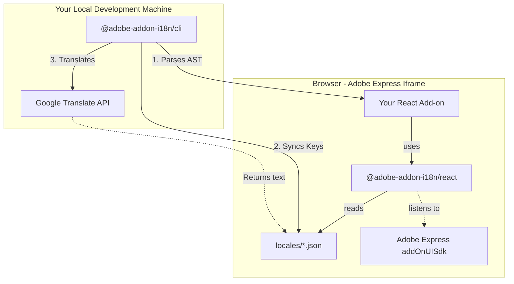

<div align="center">
  <h1>🌍 adobe-addon-i18n</h1>
  <p><strong>A zero-dependency, React-first localization infrastructure built exclusively for the Adobe Express ecosystem.</strong></p>

[](https://opensource.org/licenses/MIT)
[](https://github.com/Keshav-poha/adobe-addon-i18n/actions)
[](http://makeapullrequest.com)

</div>

<hr />

## 🤔 Why does this exist?

Building Add-ons for Adobe Express comes with a unique constraint: **iframe bundle size**.

Traditional i18n libraries ship with parsers, pluralization engines, and ICU message formatters that are powerful but heavy. When you need an add-on to load instantly inside an Adobe Express iframe, every kilobyte matters.

`adobe-addon-i18n` solves this by splitting the localization workflow into two halves:

1. **A Microscopic Runtime** (`@adobe-addon-i18n/react`): A tiny React context provider that runs in the browser. It detects the user's locale via the Adobe SDK, resolves dot-notation keys, interpolates `{{variables}}`, and handles pluralization. Zero external dependencies.
2. **A Heavyweight Local Tool** (`@adobe-addon-i18n/cli`): A CLI that runs on your machine during development. It parses your React source files using the TypeScript compiler API, extracts every `t()` call, syncs those keys into local JSON files, and auto-translates missing entries via Google Translate.

---

## 🏗️ Architecture



---

## 🚀 Getting Started

### 1. Install

```bash
# The tiny runtime goes into your production bundle
npm install @adobe-addon-i18n/react

# The CLI is a dev tool only — never ships to the browser
npm install --save-dev @adobe-addon-i18n/cli
```

### 2. Wrap your app

```tsx
import { I18nProvider, useTranslation } from '@adobe-addon-i18n/react';
import en from './locales/en.json';
import es from './locales/es.json';

const locales = { en, es };

function App() {
  const { t } = useTranslation();

  return (
    <div>
      {/* Static key */}
      <h1>{t('onboarding.title')}</h1>

      {/* Variable interpolation */}
      <p>{t('onboarding.welcome', { username: 'Keshav' })}</p>

      {/* Pluralization */}
      <span>{t('item_count', { count: 3 })}</span>
    </div>
  );
}

export default function Root() {
  return (
    <I18nProvider locales={locales} defaultLocale="en">
      <App />
    </I18nProvider>
  );
}
```

### 3. Sync your keys

You just wrote `t('onboarding.title')` in your code but haven't created any JSON files yet. Run:

```bash
npx adobe-addon-i18n sync --src ./src --locales ./locales --langs en,es,fr,de
```

The CLI reads your React source, finds all `t()` calls, and creates `en.json`, `es.json`, `fr.json`, `de.json` with empty-string placeholders for each key:

```json
{
  "onboarding": {
    "title": "",
    "welcome": ""
  }
}
```

Existing translations are **never overwritten**.

### 4. Fill in your base language

Edit `en.json`:

```json
{
  "onboarding": {
    "title": "Welcome to Adobe Express",
    "welcome": "Hello {{username}}, glad you are here!"
  },
  "item_count": "One item",
  "item_count_plural": "{{count}} items"
}
```

### 5. Auto-translate

```bash
npx adobe-addon-i18n translate --src en --locales ./locales
```

The CLI finds empty strings in your target locale files, protects `{{variables}}` from being mangled, and fills in translations automatically.

> **⚠️ Privacy notice:** The `translate` command sends your translation strings to Google's servers. Do not use it if your strings contain sensitive data. Pass `--no-translate` to skip all API calls. See the [CLI README](./packages/cli/README.md) for full details.

---

## 📖 CLI Reference

### `sync`

| Flag | Default | Description |
|---|---|---|
| `--src <path>` | `./src` | Source directory to scan |
| `--locales <path>` | `./locales` | Locale JSON output directory |
| `--langs <list>` | `en` | Comma-separated BCP 47 language tags |

### `translate`

| Flag | Default | Description |
|---|---|---|
| `--src <lang>` | `en` | Source language to translate from |
| `--locales <path>` | `./locales` | Locale JSON directory |
| `--no-translate` | — | Skip all API calls |
| `--concurrency <n>` | `5` | Max parallel translation requests |

---

## 🌐 Pluralization

Define a `<key>_plural` entry in your JSON. When `t()` is called with `{ count: N }` and `N !== 1`, the plural form is used automatically:

```json
{ "apples": "One apple", "apples_plural": "{{count}} apples" }
```

```tsx
t('apples', { count: 1 })  // → "One apple"
t('apples', { count: 7 })  // → "7 apples"
```

---

## 🔒 Security

This library applies several defences by default:

- **Prototype pollution protection** — Key path segments named `__proto__`, `constructor`, or `prototype` are rejected with an error in both the CLI and the runtime resolver.
- **Path traversal protection** — Language codes supplied to the CLI are validated against a strict BCP 47 regex before being used as filenames.
- **JSON schema validation** — Locale files that do not contain a plain JSON object are rejected before any merge operation.
- **Typed interpolation** — `params` values are constrained to `string | number | boolean`; passing objects or Promises is a TypeScript compile-time error.
- **useEffect cleanup** — The `localechange` SDK listener is properly deregistered on component unmount, preventing ghost handlers.

---

## 🤝 Contributing

Contributions are welcome! Please see [CONTRIBUTING.md](./CONTRIBUTING.md) and [CODE_OF_CONDUCT.md](./CODE_OF_CONDUCT.md).

## 📄 License

MIT — see [LICENSE](./LICENSE).
